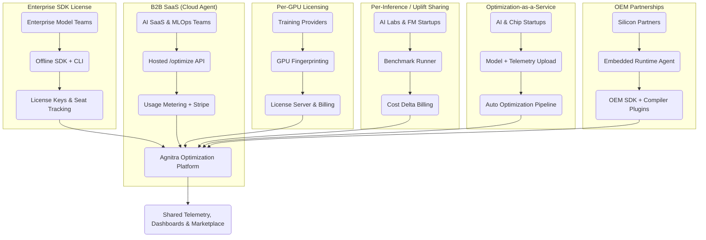

# Agnitra Monetization Overview

## Deliverable Summary

- **Cloud Agent**: REST/gRPC endpoints, async queue, API keys, Stripe usage metering.
- **Enterprise SDK**: Offline optimization workflow, seat & feature enforcement, license server toolkit.
- **Per-GPU**: NVML/nvidia-smi fingerprinting, GPU usage tracker, per-org billing.
- **Per-Inference**: Benchmark runner integrations, cost delta calculator, uplift dashboards.
- **Optimization-as-a-Service**: Secure upload portal, auto-generated kernel + patch artifacts, webhooks.
- **OEM Partnerships**: Embedded runtime stubs, hardware-specific flags, compiler plugin integration path.
